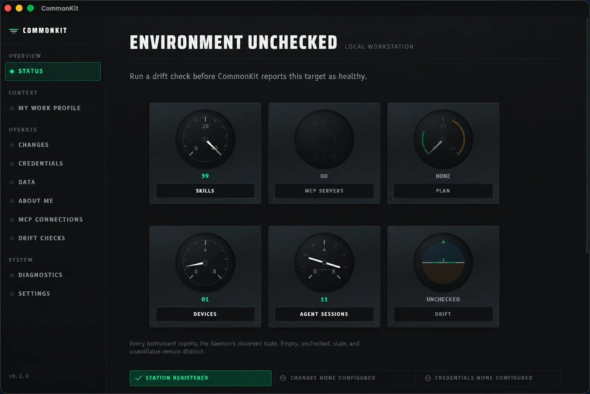

# CommonKit

**Your best development setup, everywhere.**

CommonKit carries the context that makes your coding agents effective across
agents, machines, projects, and colleagues. Version your proven instructions,
skills, tools, policies, and personal working context once. Compose the right
subset for each target, preview the change, and apply it with a receipt.

Your context stays useful when you move from Claude to Codex, from a laptop to
a remote host, or from solo work to a shared team repository. CommonKit keeps
the source portable while adapters translate it into each agent's native
configuration.

[Explore CommonKit](https://unsoldgroup.github.io/commonkit/) ·
[Read the Unsold.Group case study](docs/case-study-unsold-group.md) ·
[Install from npm](#clean-machine-source-install)



_Verified installed state on macOS; the local target name is anonymized for publication._

## Context should travel

Agent setups usually become trapped in one tool or machine. A useful skill
lives in one agent's directory. Project conventions sit in a prompt nobody
else has. A remote worker starts without the judgment available on the laptop.
New colleagues rebuild the same setup by hand.

CommonKit gives that context an owned, versioned path:

```text
organization policy + personal kit + project loadout + target overrides
                                ↓
                    inspect → plan → apply → verify
                                ↓
                  Claude · Codex · Mac · Linux · SSH
```

- **Across agents:** one source can materialize into each agent's native
  instructions, skills, hooks, plugins, and MCP declarations.
- **Across machines:** the same loadout can reconcile local and SSH targets
  without treating machine-specific state as portable truth.
- **Across projects:** project context travels beside the code and composes
  with the user's own kit.
- **Across colleagues:** an Organization CommonKit supplies shared policy and
  capabilities while each person's private context remains independently
  owned.

CommonKit is a cross-platform desired-state runtime, not an agent-package
manager or a dotfile engine. Version-pinned providers compute normalized
desired resources in isolation. CommonKit owns target policy, mutation,
receipts, verification, recovery, services, credential references, the
persistent MCP relay, and mutable-state snapshots.

## Proven in the kit we carry

Unsold.Group has inventoried the working kit it is bringing under CommonKit:
52 active skills, a 130-skill library, 14 reusable agents, seven specialist
development personas, project bundles, local services, and credential
references across a macOS workstation and a Linux VPS.

That does not make every task literally 100 times faster. It removes the
repeated setup, missing context, and environment drift that prevent a small
team from compounding its best work. The case study shows what travels today,
what stays target-specific, and which gaps CommonKit still reports honestly.

[See how Unsold.Group carries its kit →](docs/case-study-unsold-group.md)

Durable remote jobs and browser benchmark shards are handled by the Rust
`commonkit-execd` service. Remote Claude/Codex sessions receive repository-declared
tasks, issue context, plans, and skills through CommonKit MCP; execution continues
when the submitting session disconnects. See
[`docs/scopes/durable-execution-v1.md`](docs/scopes/durable-execution-v1.md).

This repository is a pnpm workspace. It also owns the independently
publishable [`mcp-local-relay`](packages/mcp-local-relay) package, which keeps
MCP upstreams warm and exposes them through one persistent local endpoint.
CommonKit remains the desired-state control plane; the relay is its MCP data
plane.

## V1 architecture

- Microsoft APM is the preferred agent-context provider.
- Chezmoi is the preferred home-configuration provider for the supported,
  side-effect-free subset.
- Native providers remain available for migration and fallback.
- On macOS, external providers fail closed unless their isolation contract is
  available; the supported native fallback remains available.
- Provider output is staged in a content-addressed artifact store; providers
  never apply directly to a managed live target.
- Filesystem, service, credential, relay, and snapshot adapters perform the
  approved operations.
- Plans bind desired, observed, policy, provider-input, ownership, and artifact
  digests. A changed input rejects an approved plan as stale.

## Clean-machine source install

Requirements are Rust 1.85+, Node.js 24+, pnpm 10.28.2, Git, and SSH. APM and
chezmoi are optional until a loadout selects them; CommonKit validates their
exact configured versions before use.

For a normal CLI and daemon installation, use the public npm package:

```sh
npm install --global @alunsoldgroup/commonkit
commonkit --version
commonkit daemon install
commonkit daemon start
```

The npm launcher selects the matching native Rust package for the current OS
and architecture, verifies its executables by SHA-256, and exposes
`commonkit`, `commonkitd`, and `commonkit-target-helper`. The signed desktop
application remains a separate native download.

To build CommonKit from source instead:

```sh
git clone https://github.com/unsoldgroup/commonkit.git
cd commonkit
corepack enable
pnpm install --frozen-lockfile
cargo install --locked --path crates/commonkit-cli
cargo install --locked --path crates/commonkit-service
commonkit --version
commonkitd --port 0
```

For unattended operation, run `commonkit daemon install` and `commonkit daemon start`; see
[the service guide](docs/DAEMON-SERVICE.md). SSH targets use the separately packaged helper in
[the target-helper guide](docs/TARGET-HELPER.md).

## Onboarding

GUI, solo CLI, and agent-assisted setup all use the same onboarding core. It
validates repository ownership, non-overlapping private and managed roots,
layer IDs, provider pins and inputs, and publication consent before making an
external change. Successful onboarding always produces a first plan for review;
it does not apply that plan.

### GUI onboarding

Open CommonKit from the menu bar and choose **Get started**. The four-step setup connects your
GitHub account, creates or connects a private setup repository, names this computer, and starts
with a safe managed folder. Existing APM or chezmoi settings are optional advanced imports.
CommonKit prepares a preview first; it does not change the selected folder until you review and
explicitly apply that plan.

The development build uses the installed GitHub CLI as its credential broker. If you are already
signed in with `gh`, CommonKit detects that account. Otherwise **Sign in with GitHub** opens the
browser flow and copies its one-time code for you to paste. Tokens remain in GitHub CLI's native
credential storage and are never returned to the desktop webview.

### Solo CLI onboarding

The daemon creates private, platform-native config and state roots plus a
0600/ACL-protected control token. In a second terminal, create or connect a kit:

```sh
commonkit init create \
  --repository unsoldgroup/my-commonkit \
  --kit-directory "$HOME/.config/my-commonkit" \
  --loadout personal \
  --target local \
  --target-root "$HOME/CommonKitManaged" \
  --publish-registration

commonkit status
commonkit sync
commonkit diff <plan-id>
commonkit apply <plan-id> --confirmed
commonkit verify
```

`init connect` uses the same arguments for an existing repository. `sync`
creates a plan; it does not mutate the target. Review `diff` before applying.
On success, initialization prints machine-readable JSON. Repository creation
or registration requires `--publish-registration`; later mutating CLI commands
require their own explicit confirmation.

### Agent-assisted onboarding

An agent may inspect `commonkit init create --help`, check `gh auth status`,
confirm that the proposed kit and target roots do not overlap, and prepare the
exact CLI command. It should explain the repository, local roots, provider, and
portable registration before asking for approval. The agent must not add
`--publish-registration` until the user explicitly approves that repository
creation or registration push. After initialization, it should show the
machine-readable JSON result and the read-only first plan, then stop again
before any `commonkit apply ... --confirmed`.

## About Me profile

CommonKit can keep an optional, portable profile about the kit owner. It is
separate from project memory: approved preferences and background facts live in
an encrypted local database, and each agent sees only the Loadout/project view
configured for it.

Agents can search approved claims and suggest a new one when the user states it
directly. Suggestions remain pending until the user accepts them. If a new
request conflicts with an approved claim, the agent asks which is current
before CommonKit replaces the old claim. Rejected suggestions are forgotten
and suppressed without retaining the rejected text.

Start the guided setup, then inspect or search the approved profile:

```sh
commonkit about-me setup --loadout personal --project my-project
commonkit about-me status
commonkit about-me summary
commonkit about-me search "communication style"
commonkit about-me suggestions
```

`about-me setup` asks a short set of plain-language questions, shows the
complete proposed profile, and writes nothing unless you answer yes. CommonKit
creates the private encryption key and database automatically. Reload or
restart the daemon after setup so connected agents receive the approved
profile tools.

Once CommonKit's MCP server is included in an agent's CommonKit-managed
loadout, the agent reads the short approved summary at session start. It
searches detailed claims only when useful, may propose a memory after a direct
statement, and asks before replacing something that conflicts with the
approved profile.

The profile text and key never enter Git. To move it between machines, register
the encrypted database with CommonKit snapshots using `format: "file"` and
provision the same key separately on the destination. See
[the headless-domain guide](docs/HEADLESS-DOMAINS.md) for configuration.

## Transactions and rollback

Every operation has a deterministic identity and runs through
prepare → apply → verify. Receipts transition durably and are hash-chain
validated. Filesystem preimages and provider payloads are content-addressed,
integrity-checked artifacts, so a fresh process can recover without rerunning a
provider, downloading content, resolving templates, or looking up secrets.

```sh
commonkit rollback <run-id> --confirmed
commonkit verify
commonkit diagnostics
```

Rollback executes verified operations in reverse order and restores supported
file bytes, resource types, permissions, symlink targets, and removals. If an
artifact is absent or has the wrong digest, recovery fails closed and preserves
an explicit recoverable receipt instead of guessing. Secret plaintext is never
stored in plans, receipts, logs, diagnostics, or portable artifact metadata.

Snapshot restore similarly stages and authenticates the snapshot and target
preimage, coordinates configured service stop/start commands, and resumes or
rolls back an interrupted transaction on daemon restart.

## Session Board

The Session Board is CommonKit's glanceable approval surface: a hub on the
always-on VPS serves `https://board.unsold.cloud` (tailnet-only) while
per-machine reporters dial out over WebSocket, streaming every Claude, Codex,
and Orca session plus the decisions they are waiting on. Approval cards answer
who/what/why (project, operation, agent intent from the transcript) with the
exact payload, and offer Allow, Always (persists a previewed project-local
permission rule through Claude Code's own `updatedPermissions` mechanism), and
Deny with an optional steer message delivered to the owning Orca terminal.
Every decision is a human tap and every failure path fails open to the normal
terminal prompt (`docs/adr/0008`, `docs/adr/0009`). Code lives in
[`apps/session-board`](apps/session-board) and
[`packages/session-board-protocol`](packages/session-board-protocol); the
operations runbook, including deploy scripts, web push, and token rotation, is
[`docs/session-board.md`](docs/session-board.md), and the domain glossary is in
`CONTEXT.md`.

## Persistent MCP relay

The Rust daemon owns a loopback-only, bearer-authenticated MCP endpoint at
`http://127.0.0.1:3764/mcp`. APM owns portable MCP declarations and generated
client configuration; CommonKit translates those declarations into persistent
relay desired state and applies relay changes transactionally. The legacy Node
`mcp-local-relay` package remains in `packages/mcp-local-relay` during
migration, with shared black-box compatibility fixtures covering initialization,
tool listing and calls, errors, bounded responses, health, and legacy config.

## Development and verification

```sh
cargo test --workspace --all-features --locked
cargo clippy --workspace --all-targets --all-features --locked -- -D warnings
pnpm run lint:oxlint
pnpm typecheck
pnpm test
```

CommonKit does not use GitHub Actions. Validation is run locally and manually on
the named macOS, Linux, or Windows machine or an explicitly selected
non-GitHub runner. Signed releases require Apple notarization, Windows signing,
Tauri updater signing, the configured HTTPS update channel, and recorded native
lifecycle evidence; release scripts fail closed when those inputs are absent.

See [CONTEXT.md](CONTEXT.md), [ADR 0005](docs/adr/0005-use-apm-for-agent-context.md),
[the v1 scope](docs/scopes/commonkit-tauri-v1.md), and
[the release policy](docs/RELEASING.md) for the product contract.
